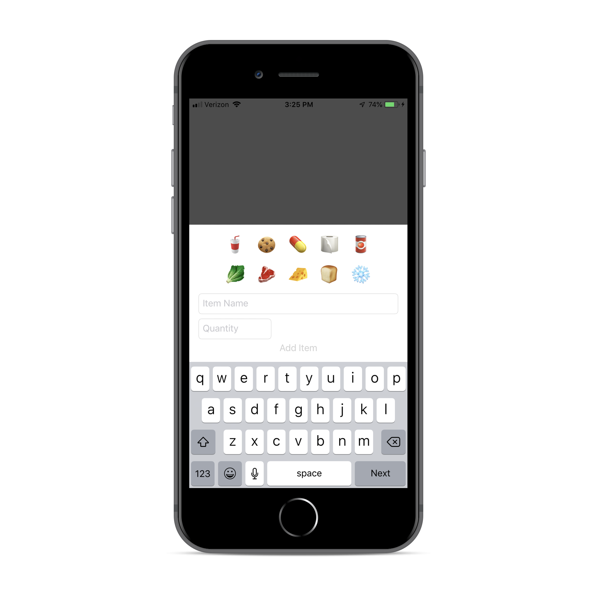
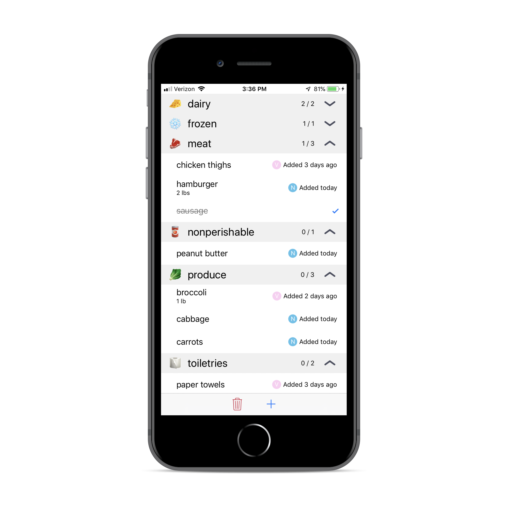

 

# A grocery list app

An app that uses Google Firebase to sync a grocery list between my wife and I.

## Built With

* [Firebase](https://github.com/firebase/)

## Authors

* **Nick Setliff**

## License

This project is licensed under the MIT License - see the [LICENSE](LICENSE) file for details
